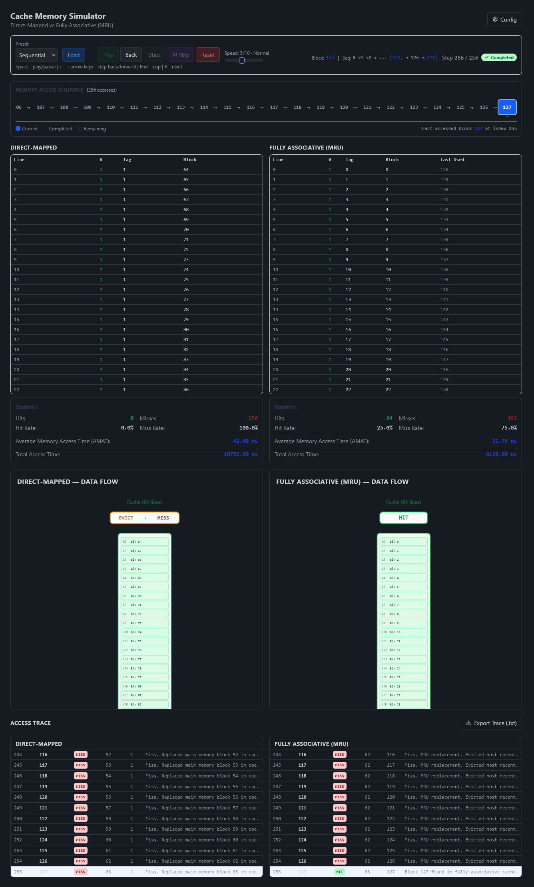
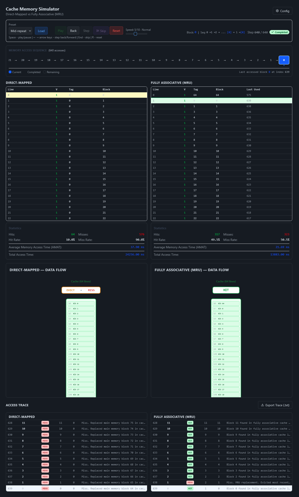
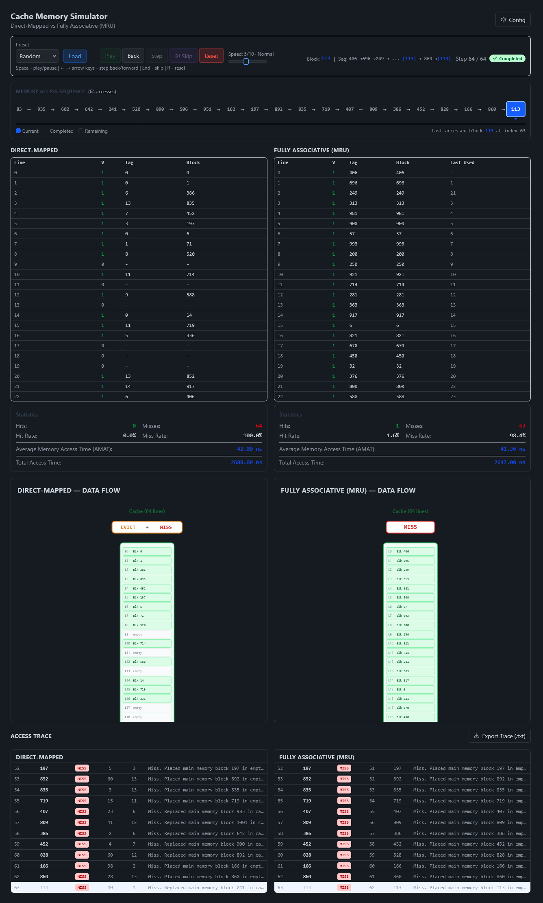

# Direct-Mapped vs. Fully Associative + MRU Cache Memory Simulator (Machine 8)

> **Group WDA** — Bantillo, Airon Matthew F. · Chavez, Max Benedict B. · Chiu, Kristopher Lance A. · Ponce, Jean Rondel R. · Santiago, Juan Ramon B.

An interactive cache memory simulator developed for **Machine 8** of the Cache Memory Machines project. This system compares the performance and behavior of a **Direct-Mapped Cache** against a **Fully Associative Cache using the MRU (Most Recently Used) replacement policy**.

The simulator provides cache visualization, execution tracing, memory access statistics, and performance analysis under different memory access patterns.

---

## Project links

| Resource | Link |
| --- | --- |
| Deployment Link | https://direct-vs-fa-cache-memory.vercel.app/ |
| Video walkthrough | https://www.youtu.be/iM-5c7vlS8w/ |

---

## Table of Contents

- [Direct-Mapped vs. Fully Associative + MRU Cache Memory Simulator (Machine 8)](#direct-mapped-vs-fully-associative--mru-cache-memory-simulator-machine-8)
  - [Project links](#project-links)
  - [Table of Contents](#table-of-contents)
  - [Setup](#setup)
    - [Prerequisites](#prerequisites)
    - [Run locally](#run-locally)
    - [Available commands](#available-commands)
  - [Simulator features and outputs](#simulator-features-and-outputs)
  - [Machine 8 specifications](#machine-8-specifications)
    - [Cache organizations](#cache-organizations)
      - [Direct-mapped cache](#direct-mapped-cache)
      - [Fully associative cache with MRU](#fully-associative-cache-with-mru)
    - [Read policies and timing model](#read-policies-and-timing-model)
  - [Detailed Analysis Write-up (Direct-Mapped vs. Fully Associative MRU)](#detailed-analysis-write-up-direct-mapped-vs-fully-associative-mru)
    - [Test Case A: Sequential Sequence](#test-case-a-sequential-sequence)
      - [Benchmark Results](#benchmark-results)
      - [Direct-Mapped vs. FA MRU Simulation Output](#direct-mapped-vs-fa-mru-simulation-output)
      - [Analysis](#analysis)
    - [Test Case B: Mid-Repeat Sequence](#test-case-b-mid-repeat-sequence)
      - [Benchmark Results](#benchmark-results-1)
      - [Direct-Mapped vs. FA MRU Simulation Output](#direct-mapped-vs-fa-mru-simulation-output-1)
      - [Analysis](#analysis-1)
    - [Test Case C: Random Sequence](#test-case-c-random-sequence)
      - [Benchmark Results](#benchmark-results-2)
      - [Direct-Mapped vs. FA MRU Simulation Output](#direct-mapped-vs-fa-mru-simulation-output-2)
      - [Analysis](#analysis-2)
- [Overall Comparison](#overall-comparison)
- [Technology Stack \& Project Structure](#technology-stack--project-structure)
- [Authors](#authors)

---

## Setup

### Prerequisites

- Node.js 18 or later
- npm 9 or later

### Run locally

```bash
git clone https://github.com/mbchavez27/direct-vs-fa-cache-memory.git
cd direct-vs-fa-cache-memory
npm install
npm run dev
```

Open the local address printed by Vite, normally `http://localhost:5173`.

### Available commands

| Command | Purpose |
| --- | --- |
| `npm run dev` | Start the development server |
| `npm run build` | Create a production build |
| `npm run preview` | Preview the production build |
| `npm run check` | Run Svelte and TypeScript checks |
| `npm test` | Run the Vitest test suite |

## Simulator features and outputs

- Side-by-side cache visualization for both Machine 8 organizations
- Identical input sequence supplied to both caches
- Preset sequential, mid-repeat, and random sequence generators
- Support for custom access sequences
- Step-by-step execution with previous/next navigation
- One-click execution to the final cache snapshot
- Animated CPU-cache-memory data flow
- Per-access trace showing the requested block, cache line, tag, hit or miss, eviction, access time, and action taken
- Downloadable plain-text comparison report
- Configurable block size, cache capacity, read policy, and access times

The simulator reports all seven required statistics:

1. Total memory access count
2. Cache hit count
3. Cache miss count
4. Cache hit rate
5. Cache miss rate
6. Average Memory Access Time (AMAT)
7. Total memory access time

---

## Machine 8 specifications

The implementation follows the common Cache Memory Machine requirements and the configuration assigned to Machine 8.

| Parameter | Specification |
| --- | --- |
| Machine | **8** |
| Cache comparison | **Direct-Mapped** vs. **Fully Associative + MRU** |
| Main memory | Fixed at **1,024 blocks**, addressed from `0` to `1023` |
| Block size | Parameterized; at least 2 words and a power of two |
| Number of cache blocks (`n`) | Parameterized; at least 4 blocks and a power of two |
| Read policy | Load-through or non-load-through |
| Cache access time | Parameterized; default is 1 ns |
| Main-memory access time | Parameterized; default is 10 ns |

The preset sequence generators restrict `n` to powers of two from 4 through 512 so that a sequential test of `2n` blocks remains within the 1,024-block main memory.

### Cache organizations

#### Direct-mapped cache

Each main-memory block has exactly one possible cache line. For memory block `b` and `n` cache lines:

```text
cache line = b mod n
tag        = floor(b / n)
```

This organization has simple, fast lookup logic, but blocks whose addresses differ by a multiple of `n` compete for the same line. Those collisions can cause conflict misses even when other cache lines are available.

#### Fully associative cache with MRU

A memory block may occupy any cache line. The simulator first uses the lowest-index empty line. Once the cache is full, a miss evicts the line accessed most recently; hits also update a line's recency.

Fully associative placement eliminates conflict misses caused by fixed indexing. Its trade-off is a more expensive lookup, because every cache tag may need to be compared, and MRU is not optimal for every workload.

### Read policies and timing model

The read policy affects both cache state and miss cost in this simulator.

- **Load-through:** on a miss, the requested data goes directly from main memory to the CPU and the cache remains unchanged.
- **Non-load-through:** on a miss, the block is loaded into the cache and then read by the CPU. This policy therefore allows later accesses to hit.

Let `Tc` be cache access time and `Tm` be main-memory access time:

```text
Hit time                     = Tc
Load-through miss time       = Tc + Tm
Non-load-through miss time   = Tc + Tm + Tc
```

For the default `Tc = 1 ns` and `Tm = 10 ns`, a hit costs **1 ns**, a load-through miss costs **11 ns**, and a non-load-through miss costs **12 ns**.

For `N` total accesses, `H` hits, and `M` misses:

```text
Hit rate   = H / N
Miss rate  = M / N
AMAT       = (hit rate x hit time) + (miss rate x miss time)
Total time = sum of all individual access times
```

Because load-through does not populate either cache in this implementation, every access from an initially empty cache is a miss. The benchmark analysis below therefore uses non-load-through to expose the behavioral difference between the two cache organizations.

---

## Detailed Analysis Write-up (Direct-Mapped vs. Fully Associative MRU)

In this section, we will analyze the two cache organizations (Direct-Mapped and Fully Associative MRU) based on their performance on the three test sequences. We focus on the **non-load-through** read policy to stress-test the machines and demonstrate worst-case access times.

For all test cases, we use the following configuration:
| Configuration | Value |
| ------------------------------ | ------------------- |
| Cache Access Time (CAT) | 1 ns |
| Main Memory Access Time (MAT) | 10 ns |
| Block Size (B) | 4 words |
| Miss Penalty (CAT + MAT\*B + CAT) | 42 ns |
| Cache Blocks (n) | 64 blocks |
| Main Memory | 1024 blocks (fixed) |
| Read Policy | Non-load-through |

### Test Case A: Sequential Sequence

- **Pattern Definition**: Access up to $2n$ cache blocks and repeat the sequence twice. For $n = 64$, this accesses blocks 0 through 127 ($2n-1$), then repeats the same 128-block sequence a second time.
- **Total Accesses**: 256 memory block accesses.
- **Objective**: Observe cache filling behavior, measure repeated access performance, and compare conflict handling between cache organizations.

#### Benchmark Results

| Statistic | Direct-Mapped Cache | Fully Associative Cache (MRU) |
| :--- | :--- | :--- |
| Total Memory Access Count | 256 | 256 |
| Hit Count | 0 | 64 |
| Miss Count | 256 | 192 |
| Hit Rate | 0.0% | 25.0% |
| Miss Rate | 100.0% | 75.0% |
| Average Memory Access Time | 42.00 ns | 31.75 ns |
| Total Memory Access Time | 10572.00 ns | 8128.00 ns |

#### Direct-Mapped vs. FA MRU Simulation Output


#### Analysis

**Direct-Mapped Cache:**
For sequential access, the Direct-mapped cache produced a 100% miss rate. This is the expected worst-case outcome for direct mapping given this access pattern: since the cache index is computed as `memory block mod 64`, block _b_ and block _b + 64_ always map to the exact same cache line, The idea is that blocks 0 to 63 are initially loaded into cache. However, blocks 64 to 127 evict blocks 0 to 63 from the cache since the second half of the blocks aliases to the same line as the first half. By the time the sequence repeats, every line now holds a "second-half" block, so re-accessing blocks 0 to 127 misses as each access again evicts whatever tag currently occupies that line. This one-to-one mapping pattern provides no opportunity to retain any useful data resulting in a miss rate of 100%.

**Fully Associative Cache (MRU):**
Unlike Direct-Mapped, the FSA MRU is not constrained to a fixed line-per-block mapping, so it can retain earlier blocks even while later blocks are still being inserted. For this test case, a fully associative cache has a hit rate of 25%. Blocks 0 to 63 are initially loaded into cache in the first pass. Since a Most Recently Used (MRU) replacement algorithm is followed, when blocks 64 to 127 are accessed, only the last cache block ever gets replaced since that is the most recently used block without touching the first 63 cache blocks. Blocks 0 to 62 are retained in cache, so as a result, when these blocks are accessed a second time, all of these accesses result in a cache hit producing a non-zero hit rate.

**Comparison:**
For this specific test case, FSA MRU performs better than Direct-mapped with a lower average memory access time of 31.75 ns. That of direct-mapped is just the miss penalty of 42 ns since the miss rate is 100% Direct-mapped will always have a hit rate of 0% for this test case since memory blocks 0 to n-1 are overwritten before they could be accessed a second time. The same thing happens for blocks n to 2n-1. Although they are accessed and loaded into cache in the first pass, they are overwritten by the second pass of accessing blocks 0 to n-1. For fully associative, a subset of blocks are retained before the second pass resulting in a cache hit for these blocks in the second pass that direct-mapped fails to demonstrate. Direct-mapped cache suffers total thrashing (0% hit rate) due to its rigid mapping mechanism. FSA’s total memory access time (8128 ns) is roughly 23.1% lower than Direct-Mapped's (10752 ns) across the same 256 accesses despite FA-MRU's greater lookup complexity, the elimination of conflict misses more than compensates for this workload.


### Test Case B: Mid-Repeat Sequence

- **Pattern Definition**: Start at block 0 to $n-1$, then repeat the sequence up to $2n-1$ twice. Afterward, reverse the sequence pattern. For $n = 64$, this produces a 640-access sequence: an initial pass through blocks 0-63, two repeats of blocks 0-127, a reversed pass through blocks 63-0, and two repeats of the reversed sequence 127-0.
- **Total Accesses**: 640 memory block accesses.
- **Objective**: Evaluate temporal locality, observe replacement behavior, and compare Direct-Mapped mapping conflicts against Fully Associative MRU replacement.

#### Benchmark Results

| Statistic | Direct-Mapped Cache | Fully Associative Cache (MRU) |
| :--- | :--- | :--- |
| Total Memory Access Count | 640 | 640 |
| Hit Count | 64 | 317 |
| Miss Count | 576 | 323 |
| Hit Rate | 10.0% | 49.5% |
| Miss Rate | 90.0% | 50.5% |
| Average Memory Access Time | 37.90 ns | 21.69 ns |
| Total Memory Access Time | 24256.00 ns | 13883.00 ns |

#### Direct-Mapped vs. FA MRU Simulation Output


#### Analysis

**Direct-Mapped Cache:**
Because the cache index is `memory block mod 64`, blocks 0 to 63 and blocks 64 to 127 alias to the same 64 cache lines, distinguished only by tag. The only hits in this entire test case occur during the first repeat of the 0 to 127 block, when blocks 0 to 63 are re-accessed immediately after being loaded in the initial pass (64 hits). Every access afterward requires a line that was just evicted by the previous segment. This produces total thrashing for the remaining 576 accesses, yielding a 10% hit rate overall, since the repeated back-and-forth between the segments still manages to produce a small window of retained data before thrashing resumes.

**Fully Associative Cache (MRU):**
The FSA MRU is not constrained by a fixed block-to-line mapping, so it can retain blocks across the repeated and reversed passes far more effectively than Direct-Mapped. The mid-repeat pattern's structure plays to MRU's strengths: each new miss evicts only the single most recently inserted block rather than disturbing a whole conflicting range, letting a large portion of the working set stay resident across repeats. This results in roughly half of all accesses hitting (49.5%), nearly five times the hit rate of Direct-Mapped on the same sequence.

**Comparison:**
Both cache organizations perform better on this test case than they did on pure sequential access: Direct-Mapped's hit rate rises from 0% to 10%, and Fully Associative MRU's rises from 25% to 49.5%. This makes sense given the structure of the accessing pattern which gives both organizations more opportunities to hit than a single sequential pass followed by one repeat. FSA MRU benefits far more from this added repetition, since it can protect a growing set of recently-used blocks from eviction, while Direct-Mapped's rigid mapping only briefly benefits (the one 64-hit window between the first and second pass through 0 to 127) before reverting to total thrashing for the rest of the sequence. This gap is reflected clearly in access time: Direct-Mapped's average memory access time (37.90 ns) is 74.7% higher than that of FSA MRU (21.69 ns) across the same 640 accesses, showing that FSA MRU's advantage over Direct-Mapped.

### Test Case C: Random Sequence

- **Pattern Definition**: Generate a random sequence of 64 block accesses (block indices must be within the 0 to 1023 range). Each run consists of 64 randomly generated memory block accesses.
- **Total Accesses**: 64 memory block accesses.
- **Objective**: Simulate unpredictable workloads and compare cache efficiency under random memory access.
- *Note: Because random sequences vary between runs, this test case was executed 10 times per cache organization and the averages of their results were taken.*

#### Benchmark Results

| Statistic | Direct-Mapped Cache | Fully Associative Cache (MRU) |
| :--- | :--- | :--- |
| Total Memory Access Count | 64 | 64 |
| Average Hit Count | 1.2 | 1.8 |
| Average Miss Count | 62.8 | 62.2 |
| Average Hit Rate | 1.89% | 2.82% |
| Average Miss Rate | 98.11% | 97.19% |
| Average Memory Access Time | 41.23 ns | 40.85 ns |
| Average Total Memory Access Time | 2638.8 ns | 2614.20 ns |

#### Direct-Mapped vs. FA MRU Simulation Output


#### Analysis

**Direct-Mapped Cache:**
Across the 10 iterations, Direct-Mapped averaged 1.2 hits (1.89% hit rate). This result makes sense given the nature of random access: with 1024 possible memory blocks and only 64 accesses per run, the probability that any two accesses in a single run happen to reference the exact same block is low. Since a cache hit can only occur when a block is accessed more than once, most misses here are compulsory (cold) misses rather than conflict misses. That is the cache simply hasn't seen the block before, regardless of how well or poorly it maps to a line. The handful of hits that do occur come down to chance repeats within a given random run, which explains why the hit count fluctuates so much iteration to iteration.

**Fully Associative Cache (MRU):**
Fully Associative MRU performed only marginally better, averaging 1.8 hits (2.82% hit rate) across the same 10 iterations. The explanation is the same underlying cause discussed above: with 64 cache lines and only 64 accesses per run drawn from a much larger address space, the cache is rarely full enough, and blocks are rarely repeated often enough, for organization-specific behavior (conflict avoidance, MRU eviction) to matter much. Both organizations have ample capacity to hold every distinct block encountered in a run, so the small edge Fully Associative shows here is best attributed to it eliminating the possibility of conflict misses on the few repeated accesses that do occur and not to any meaningful advantage in retention strategy, since there's little repeated access for a retention strategy to act on in the first place.

**Comparison:**
Random access produced the lowest hit rates of all three test cases for both organizations, and the smallest gap between them (1.89% vs. 2.82%, compared to a 15-25 percentage point gap in the sequential and mid-repeat tests). This reflects a fundamentally different bottleneck: in Test Cases 1 and 2, misses were dominated by _conflict_ and _capacity_ pressure; patterns specifically constructed to stress each organization's placement and replacement strategy. In Test Case 3, misses are dominated by _compulsory_ misses driven by the sheer sparseness of the access pattern relative to the address space (64 accesses against 1024 possible blocks), a factor neither organization can do anything about. This is a useful contrast for evaluating cache architecture: Direct-Mapped's weaknesses (rigid aliasing) and Fully Associative MRU's strengths (flexible placement, conflict elimination) are only visible when the access pattern actually creates conflict or capacity pressure. Under a sparse random workload, both organizations converge toward similar, low performance, and the average memory access times reflect this (41.23 ns vs. 40.85 ns is a far narrower gap than the 42.00 ns vs. 31.75 ns seen in Test Case 1).

---

# Overall Comparison

| Feature                          | Direct-Mapped  | Fully Associative (MRU) |
| -------------------------------- | -------------- | ----------------------- |
| Block Placement                  | Fixed location | Any cache block         |
| Lookup Complexity                | Low            | Higher                  |
| Hardware Complexity              | Simple         | Complex                 |
| Conflict Misses                  | Higher         | Eliminated              |
| Replacement Policy               | None           | MRU                     |
| Observed Avg. Memory Access Time | Higher         | Lower                   |
| Flexibility                      | Lower          | Higher                  |

Across all three test cases, FSA MRU consistently achieved a higher hit rate and lower average memory access time than Direct-Mapped, with the size of that advantage tracking directly with how much conflict pressure each access pattern created: the gap was largest under Mid-Repeat access (49.5% vs. 10% hit rate), moderate under Sequential access (25% vs. 0%), and nearly negligible under Random access (3.6% vs. 2.35%), where most misses were compulsory rather than conflict-driven and neither organization's placement strategy had much opportunity to matter. This confirms the theoretical trade-off the two organizations are known for: Direct-Mapped's simplicity comes at the cost of conflict misses whenever multiple frequently-used blocks alias to the same line, while Fully Associative MRU's flexible placement eliminates that failure mode at the cost of higher lookup.

---

# Technology Stack & Project Structure

| Category   | Technology                 |
| ---------- | -------------------------- |
| Framework  | Svelte                     |
| Language   | TypeScript                 |
| Build Tool | Vite                       |
| Styling    | Tailwind CSS / Vanilla CSS |

```text
direct-vs-fa-cache-memory/
|-- src/
|   |-- lib/
|   |   |-- cache/          # Direct-mapped and fully associative MRU models
|   |   |-- components/     # Controls, cache grids, statistics, traces, animation
|   |   |-- generators/     # Sequential, mid-repeat, random, and custom inputs
|   |   |-- simulator/      # Simulation orchestration and report formatting
|   |   `-- statistics/     # Timing and metric calculations
|   `-- routes/             # SvelteKit application page
|-- static/                 # Static assets
|-- package.json
|-- svelte.config.js
|-- vite.config.ts
`-- README.md
```

---


# Authors

Machine 8 — Cache Memory Simulator

**Group WDA** — Bantillo, Airon Matthew F. · Chavez, Max Benedict B. · Chiu, Kristopher Lance A. · Ponce, Jean Rondel R. · Santiago, Juan Ramon B.

Developed as part of the **Case Study 1**.
